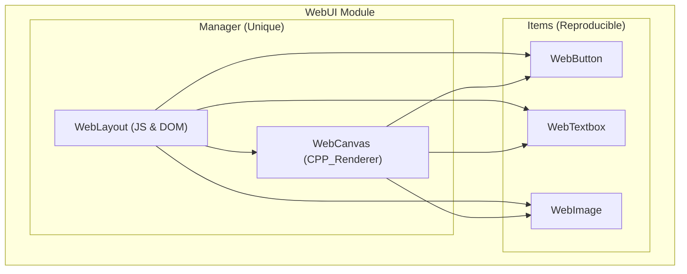
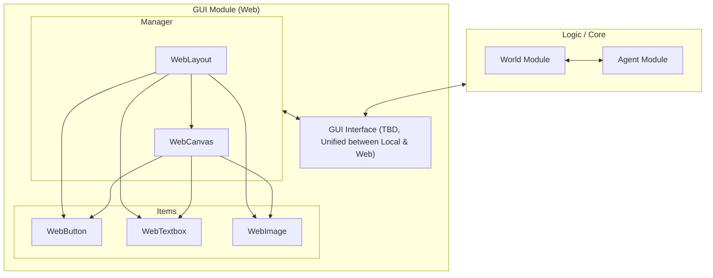

> [!IMPORTANT]
>
> **AI Usage and Attribution Statement**
>
> Please note that portions of the documentation in this directory were formatted and refined using LLM-based tools for documentation optimization; however, all design decisions and class-specific concepts were ultimately developed and finalized individually by the respective team members.
>
> Note: This README file was written entirely manually without the use of LLM tools.

# Group 18's Write-up for Initial C++ Class (WebUI)

*Last updated: Jan 30, 2026*

**Contents:**

1. [Abstract](#1-abstract)
2. [Some Thoughts For Overall Architecture (Draft)](#2-some-thoughts-for-overall-architecture-draft)
3. [Classes Specifications](#3-classes-specifications)

## 1 Abstract

This document primarily presents the initial detailed design concepts for the following five classes, as well as the proposed architectural design of the *Web Interface* module within the overall project.

The descriptions below are based on the course documentation:

> **`WebImage`** - A class to manage an HTML image from your C++ code. It should simplify image usage in the program, handling asset loading and allowing a programmer to select size, position, alt text, etc, through C++ functions.
>
> **`WebTextbox`** - A class to manage an HTML text block from your C++ code, including font and format information.
>
> **`WebButton`** - A web button that will call a designated function when clicked. You should have some control over the button properties (size, coloring, ability to disable, etc) depending on what you believe will be most useful.
>
> **`WebCanvas`** - A class to manage an HTML5 canvas object, allowing more dynamic drawing to the screen.
>
> **`WebLayout`** - A class to manage the layout of other web objects on the screen, directly interfacing with the HTML DOM.

## 2 Some Thoughts For Overall Architecture (Draft)

Although these aspects are not yet fully finalized and the detailed design will depend on future inter-group discussions, we have already formed a preliminary conceptual understanding of the overall structure of the application.

With regard to the Web Interface module, our team generally agrees that the current functional framework should be handled entirely by the five initial classes. **At this stage, the functional boundary of our module concerns how we structure and divide responsibilities for the entire screen and all user-facing interface interactions. However, prior to coordination with other groups, the extent of functional flexibility we should provide and the specific interface designs remain undefined.**

### 2.1 Overall Architecture of the Web Interface Module (Draft)

As stated earlier, we believe the Web UI module should encompass all non-logic functionalities within the entire screen scope, thereby providing greater flexibility for future integration with other system components.

As suggested in the course documentation, `WebLayout` is intended to represent the entire screen — in the web context, this corresponds to the full DOM of the webpage. It is responsible for the complete lifecycle of the page, including the creation of other objects and the management of external function interfaces (FFI) for interoperability between JavaScript and C++.

Among these components, `WebCanvas` serves as the core element. Similar to a video player on platforms like YouTube, it uses the `<canvas>` element to manage and render game content produced by C++ code (preferably via OpenGL).

In contrast, `WebImage`, `WebButton`, and `WebTextbox` function as reusable container or data-type objects that are solely responsible for managing their content. These objects can be rendered either as DOM elements by `WebLayout` or as visual elements within the canvas by `WebCanvas`.

### 2.2 Position of the Web Interface Module within the Overall Application (Draft)

Building upon this foundation, in order to ensure module interchangeability, we will collaborate with the Local GUI team (Group 17) to design a unified interface between the UI layer and the logic modules after the core functionalities have been implemented.

Regarding the Web UI version, our intended build and deployment approach is to compile the entire project using Emscripten, producing a fully frontend-executed application. All modules will run within the browser environment using a WASM-based runtime.

## 3 Classes Specifications

In order to keep this README focused on the high-level role of Group 18 and the overall architecture, the detailed design of each C++ class is documented in separate markdown files that live in the same directory as this README.

Each class specification follows the structure required by the course documentation (Class Description, Similar Standard Library Classes, Key Functions, Error Conditions, Expected Challenges, Coordination with Other Classes/Groups).

The class-level documents are:

### [3.1 `WebImage` Class Specification (./WebImage.md)](./WebImage.md)

### [3.2 `WebTextbox` Class Specification (./WebTextbox.md)](./WebTextbox.md)

### [3.3 `WebButton` Class Specification (./WebButton.md)](./WebButton.md)

### [3.4 `WebCanvas` Class Specification (./WebCanvas.md)](./WebCanvas.md)

### [3.5 `WebLayout` Class Specification (./WebLayout.md)](./WebLayout.md)

These files are the source of truth for the concrete APIs, invariants, and error-handling strategies of each class. This README only summarizes the module’s purpose and architecture; for any class-specific questions, please refer to the corresponding document above.